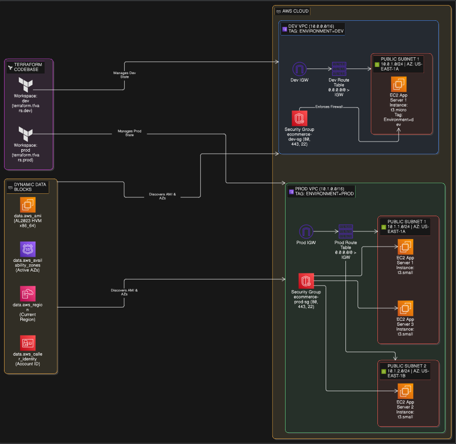

# Multi-Environment AWS Infrastructure for E-Commerce

This project provisions isolated **Development (`dev`)** and **Production (`prod`)** environments on AWS using a single, reusable Terraform codebase with **Terraform Workspaces**, **environment-specific `.tfvars`**, and **dynamic AWS data blocks**.

---

## Architecture Summary

| Characteristic | Development (`dev`) | Production (`prod`) |
| :--- | :--- | :--- |
| **Terraform Workspace** | `dev` | `prod` |
| **State Storage** | Isolated `dev` state | Isolated `prod` state |
| **VPC CIDR** | `10.0.0.0/16` | `10.1.0.0/16` |
| **Public Subnets** | 1 (`10.0.1.0/24`) | 2 (`10.1.1.0/24`, `10.1.2.0/24`) |
| **Availability Zones** | 1 (`us-east-1a`) | 2 (`us-east-1a`, `us-east-1b`) |
| **EC2 Count** | 1 instance | 3 instances (distributed across AZs) |
| **EC2 Instance Type** | `t3.micro` (cost-optimized) | `t3.small` (higher capacity) |
| **Security Group** | `ecommerce-dev-sg` | `ecommerce-prod-sg` |
| **Tagging (`Environment`)**| `dev` | `prod` |

---

## Architecture Diagram



---

## Project Structure

```text
.
├── terraform/
│   ├── main.tf                 # Core infrastructure (VPC, Subnets, SG, EC2, IGW, RT) + 4 Data blocks
│   ├── variables.tf            # 9 configurable variables with type constraints and validation
│   ├── terraform.tf            # Terraform required version and AWS provider configuration
│   ├── outputs.tf              # Informative outputs (IDs, IPs, discovered AMI, account, region)
│   ├── terraform.tfvars.dev    # Environment configuration for DEV
│   └── terraform.tfvars.prod   # Environment configuration for PROD
└── README.md
```

---

## Dynamic Data Blocks in `main.tf`

No hardcoded AWS resource IDs (AMIs, VPCs, AZs) are used. The following 4 data blocks dynamically discover AWS environment details:

1. `data "aws_ami" "amazon_linux"`: Automatically retrieves the latest official Amazon Linux 2023 HVM x86_64 AMI.
2. `data "aws_availability_zones" "available"`: Discovers available AZs in the target region.
3. `data "aws_region" "current"`: Discovers the current AWS region.
4. `data "aws_caller_identity" "current"`: Discovers the active AWS account ID.

---

## Verification Commands

Run all commands from the `terraform/` directory:

```bash
cd terraform
```

### 1. List Workspaces
```bash
terraform workspace list
```
Expected output:
```text
  default
  dev
* prod
```

### 2. Validate Terraform Configuration
```bash
terraform validate
```
Expected output:
```text
Success! The configuration is valid.
```

### 3. Verify Data Blocks in `main.tf`
```bash
grep -c "^data " main.tf
```
Expected output:
```text
4
```

### 4. Test Development Environment Plan
```bash
terraform workspace select dev
terraform plan -var-file="terraform.tfvars.dev"
```
* Plans 7 resources: 1 VPC (`10.0.0.0/16`), 1 subnet (`10.0.1.0/24`), 1 IGW, 1 Route Table & Association, 1 Security Group, 1 EC2 instance (`t3.micro`).

### 5. Test Production Environment Plan
```bash
terraform workspace select prod
terraform plan -var-file="terraform.tfvars.prod"
```
* Plans 11 resources: 1 VPC (`10.1.0.0/16`), 2 subnets (`10.1.1.0/24`, `10.1.2.0/24`), 1 IGW, 1 Route Table & 2 Associations, 1 Security Group, 3 EC2 instances (`t3.small` distributed across AZs).

---

## Dynamic User Input Demo

When running `terraform plan` in an interactive terminal, Terraform will pause and dynamically prompt for the operator's name:

```text
var.operator_name
  Enter the name of the engineer/operator deploying this infrastructure (Dynamic User Input)

  Enter a value: Aniket
```

This dynamically tags all AWS resources with `Operator = <your-name>` and includes it in the `operator` output without hardcoding.

